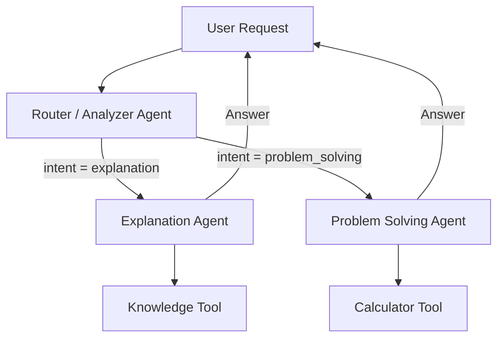

# Архитектура мультиагентной системы

## Учебный ассистент на LangChain + LangGraph

### 1. Общее описание системы

Данная система представляет собой **мультиагентную сеть**, реализованную с использованием фреймворков **LangChain** и **LangGraph**.
Назначение системы — обработка учебных запросов пользователя (в первую очередь по техническим дисциплинам), автоматическое определение типа запроса и передача управления специализированному агенту для генерации ответа.

Система поддерживает:

* маршрутизацию запросов между агентами,
* вызов инструментов (tool calling),
* хранение состояния и краткой памяти сессии.

---

### 2. Агенты в системе и их роли

В системе реализованы следующие агенты:

#### 2.1 Router / Analyzer Agent

**Назначение:**

* анализ входного запроса пользователя;
* классификация запроса по типу задачи;
* принятие решения о передаче управления специализированному агенту.

**Функции:**

* определяет intent (`explanation` или `problem_solving`);
* извлекает предметную область (например, математика, физика);
* инициирует handoff управления в LangGraph.

---

#### 2.2 Explanation Agent

**Назначение:**

* предоставление теоретических объяснений учебных тем.

**Функции:**

* формирует объяснение понятий и теории;
* адаптирует стиль ответа с учётом информации из памяти (уровень пользователя, предыдущие темы);
* при необходимости использует инструмент поиска/доступа к справочной информации.

---

#### 2.3 Problem Solving Agent

**Назначение:**

* пошаговое решение учебных задач и примеров.

**Функции:**

* логическое рассуждение над задачей;
* использование вычислительных инструментов для получения точного результата;
* генерация объяснений шагов решения.

---

### 3. Используемые паттерны мультиагентных систем

В дизайне системы реализованы следующие паттерны МАС:

#### 3.1 Router + Specialized Agents

Основной архитектурный паттерн системы.

* Router Agent принимает решение о маршрутизации запроса.
* Управление передаётся одному из специализированных агентов:

  * Explanation Agent
  * Problem Solving Agent

Этот паттерн позволяет:

* изолировать ответственность агентов;
* упростить расширение системы;
* повысить интерпретируемость логики работы.

---

#### 3.2 Supervisor-подобная роль (частично)

Router Agent выполняет упрощённую роль supervisor:

* контролирует поток выполнения;
* принимает решение, какой агент активен в текущем шаге;
* завершает выполнение после получения ответа.

---

### 4. Поток управления и данных

Ниже представлена диаграмма потока управления системы.



**Handoff управления** происходит в узле Router Agent, где на основании анализа запроса определяется следующий активный агент.

---

### 5. Использование tool calling

В системе используется **по одному инструменту для каждого специализированного агента**.

#### 5.1 Tool calling в Explanation Agent

**Инструмент:**

* справочный / knowledge tool (например, поиск определения или примеров)

**Цель использования:**

* уточнение формулировок;
* получение корректных определений и терминов;
* повышение точности теоретических объяснений.

Tool вызывается только при необходимости, когда агенту требуется внешняя информация.

---

#### 5.2 Tool calling в Problem Solving Agent

**Инструмент:**

* калькулятор (Python tool)

**Цель использования:**

* выполнение арифметических и алгебраических вычислений;
* исключение ошибок в численных расчётах;
* демонстрация корректного результата пользователю.

Вызов инструмента осуществляется через механизм `tool_call` LangChain.

---

### 6. Управление памятью и состоянием

Для хранения контекста используется **состояние LangGraph**, общее для всей сессии.

#### 6.1 Что хранится в памяти

* история последних запросов пользователя;
* текущая предметная область (`subject`);
* предполагаемый уровень пользователя (например, beginner);
* последний выбранный тип задачи.

Пример состояния:

```json
{
  "subject": "mathematics",
  "level": "beginner",
  "history": ["Объясни производную", "Реши пример"]
}
```

---

#### 6.2 Как память влияет на работу системы

* Router Agent использует память для уточнения классификации запроса;
* Explanation Agent адаптирует сложность объяснений;
* Problem Solving Agent опирается на предыдущий контекст задачи.

Таким образом, система демонстрирует **контекстно-зависимое поведение** между шагами взаимодействия.

---

### 7. Итог

Предложенная архитектура удовлетворяет требованиям лабораторной работы:

* реализована мультиагентная система;
* присутствует агент-маршрутизатор;
* используются специализированные агенты;
* реализованы tool calls;
* поддерживается память и состояние;
* управление агентами реализовано через LangGraph.