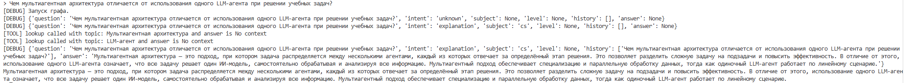
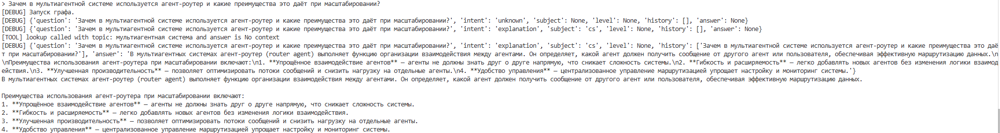
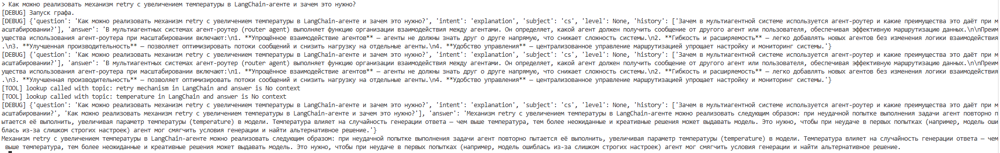
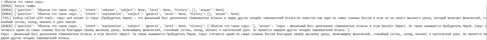
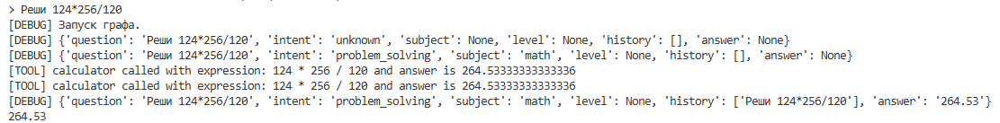

# Архитектура системы

### 1. Идея системы
Система которая в зависимости от типа запроса пользователя подберет подходящего агента для ответа.

**Система поддерживает:**
* маршрутизацию запросов между агентами,
* вызов инструментов (tool calling),
* хранение состояния и краткой памяти сессии.

**Особенности:**

* анализ входного запроса пользователя;
* классификация запроса по типу задачи;
* принятие решения о передаче управления специализированному агенту.
* использование инструментов для более точного ответа с учетом контекста запроса.

---

### 2. Агенты в системе и их роли

#### 2.1 Router / Analyzer Agent
Определяет какому агенту передать запрос пользователя

**Функции:**
* определяет intent (`explanation` или `problem_solving`);
* извлекает предметную область (например, математика, физика);

#### 2.2 Explanation Agent
Агент предназначенный для предоставления теоретических объяснений различных тем.

**Функции:**
* формирует объяснение понятий и теории;
* адаптирует стиль ответа с учётом информации из памяти;
* при необходимости использует инструмент поиска/доступа к справочной информации.

#### 2.3 Problem Solving Agent
Агент предназначенный для решения математических задач.

**Функции:**
* использование вычислительных инструментов для получения точного результата;

---

### 3. Используемые паттерны мультиагентных систем

#### 3.1 Router + Specialized Agents

Основной архитектурный паттерн системы.

* Router Agent принимает решение о маршрутизации запроса.
* Управление передаётся одному из специализированных агентов:

  * Explanation Agent
  * Problem Solving Agent

#### 3.2 Supervisor-подобная роль (частично)

Router Agent выполняет упрощённую роль supervisor:

* контролирует поток выполнения;
* принимает решение, какой агент активен в текущем шаге;
* завершает выполнение после получения ответа.

---

### 4. Поток управления и данных

Диаграмма потока управления системы.


---

### 5. Использование tool calling

В системе используется два инструмента.

#### 5.1 lookup в Explanation Agent

Вызывается при необходимости, когда агенту требуется внешняя информация. Предоставляет доступ к заданной базе данных по ключевым словам в запросе.
Пример:
```
{
    "производная": (
        "Производная показывает скорость изменения функции. Формально это предел "
        "отношения приращения функции к приращению аргумента."
    ),
    "интеграл": (
        "Интеграл — обобщение суммы бесконечно малого. Используется для вычисления "
        "площадей, объемов и накопленных величин."
    ),
    "сирус": (
        "Сирус (Пробудитель миров) — это финальный босс дополнения «Завоеватели Атласа» и лидер других четырёх завоевателей Атласа."
        "Он известен как один из самых сложных боссов в игре из-за своего высокого урона, который включает физический, стихийный (огонь, холод, молния) и урон хаосом. "
    ),
}
```

#### 5.2 calculator в Problem Solving Agent

При наличии в запросе математических выражений вычисляет их результат.

---

### 6. Управление памятью и состоянием

Для хранения контекста используется **состояние LangGraph**, общее для всей сессии.

**Хранится:**
* история последних запросов пользователя;
* текущая предметная область (`subject`);
* последний выбранный тип задачи.

Пример:
```json
{
  "subject": "mathematics",
  "level": "beginner",
  "history": ["Объясни производную", "Реши пример"]
}
```

---

# Эсперименты

1. Концептуальный/теоретический вопрос про МАС или LLM-агентов.


2. Вопрос по проектированию/архитектуре.


3. Вопрос по реализации/программированию.


4. Вопрос по объяснению термина.


5. Вопрос по решению математического выражения.


В целом система ответила но все поставленные вопросы. Во время ответа в кождом из вопросов были вызваны те агенты которые и ожидались. Так же все соответствующие инстументы были вызваны. Если смотреть на 4 вопрос то видим как сеть используя информцию из памяти успешно поняла что такое Сирус. В целом сеть хорошо решает поставленные задачи, если задаваемые вопросы не являются сильно комплексными.

---

# Рефлексия

Была реализована мультиагентная система на основе LangChain и LangGraph, использующая агент-роутер, специализированные агенты и инструменты для расширения возможностей LLM. В целом архитектурные решения показали себя устойчивыми и удобными для решения поставленных задач.

**Что сработало хорошо**

* Agent Router, корректно классифицировал пользовательские запросы и передавал управление соответствующему специализированному агенту. Логика handoff между агентами была прозрачной и хорошо контролируемой через LangGraph, что позволило явно отслеживать поток выполнения.
* Разделение агентов по ролям (Explanation Agent и Problem Solving Agent) обеспечило разграничение ответственности и позволило применять разные промпты и инструменты для различных типов задач.
* Использование инструментов (lookup и calculator) было удачно интегрировано в логику агентов. Инструменты вызывались автоматически только при необходимости и не мешали генерации ответа, выступая как источник дополнительного контекста или вычислительных результатов.

**Неожиданное поведение и ограничения**

* Использование инструментов может приводить к неожиданным эффектам, если инструмент не возвращает полезного контекста. В таких случаях модель могла формировать нестабильные ответы или некорректно следовать формату структурированного вывода.
* Память имеет базовую реализацию и хранит прост овсе прошле запросы пользователя. Это может приводить к избыточному или не всегда релевантному использованию контекста при ответах.
* Система рассчитана на относительно простые запросы. При увеличении сложности задач или появлении неоднозначных формулировок возможны ошибки в ответах.

**Возможные направления развития системы**

* Можно добавить отдельного агента-оценщика (reviewer), который бы корректировал ответы агентов перед возвратом пользователю. Это повысило бы надёжность и качество результатов.
* Управление памятью можно усложнить, введя более структурированное долговременное хранилище. Также возможно использование summary-памяти для уменьшения объёма контекста.
* Архитектуру можно расширить за счёт дополнительных агентов. Это позволило бы системе решать более комплексные и составные задачи.